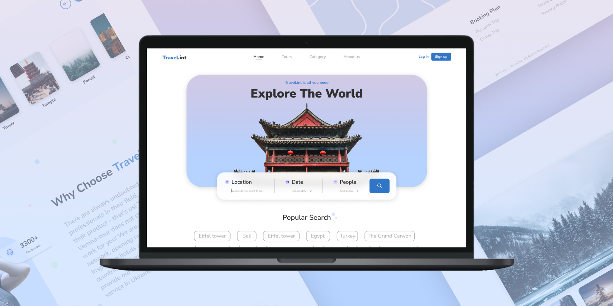

<h1 align="center">
    <a href="https://www.figma.com/community/file/1031669453280336591">Travel.init</a>
</h1>
 
 Layout desenvolvido por **[Illia Frunza]('https://www.figma.com/@rengen_ill') @rengen_ill**

 

> Projeto desenvolvido para fins de estudo.

## 🔥 Como usar?
1. Clone o repositório na sua máquina
2. Abra o arquivo `index.html` no navegador ou abra o projeto com o `LiveServer` no **Visual Studio Code**

## 💻 Tecnologias/Ferramentas
- FIGMA 
- HTML5
- CSS3
- JAVSCRIPT
